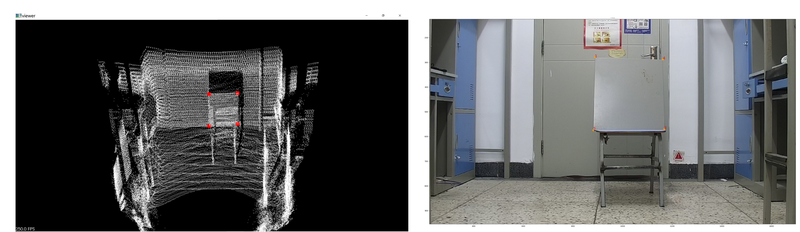

# 激光雷达和相机标定
## 一、环境与依赖
* 环境

  WINDOWS:
  ./src 与./include下的脚本

  ubuntu ROS:
  ./ROS 下是对图像流进行截图(snapShot.cpp)和交互提取特征点(show_coordinate)的节点脚本

* 依赖
  `PCL`, `OpenCV`

## 二、硬件
Livox Horizon 激光雷达 + Hikvision 相机

## 三、介绍
激光雷达和相机之间标定需要标定相机的内参、畸变系数和相机相对于激光雷达的位姿。下面是一种先标定相机内参、畸变系数；在矫正图像后，再手动提取角点进行3D-2D匹配的标定方法，具体步骤如下：

1. 用张正友标定法标定相机内参和畸变系数，通过Matlab或者OpenCV等标定工具得到(cal_extrinsic.cpp中calib::zhang_zhengyou_calib函数)，实验中OpenCV的重投影精度比MatLab配准工具箱要小。
   
    

   <h6 align="center">张正友标定法</h6>
   
   
   
2. 点云不含纹理信息，因此不能用角点进行外参标定，这里用一块铁板在开阔的地区进行标定。

    

    <h6 align="center">外参标定板</h6>

3. 使用livox-viewer录制点云流数据(.lvx文件)和用OpenCV抓图。

4. 使用lvx_parser文件夹下的pylvx.py脚本将lvx文件转成pcd文件。

5. 将多帧点云合成一帧(read_pcds_xyz函数)，然后分别进行点云特征点(interact_visualize函数)和图像对应特征点(Matlab)的提取，转换成一个
    已知相机内参、三维点及对应投影点情况下计算相机位姿的PnP(Perspective-n-Point)问题。

  

  <h6 align="center">交互提取角点</h6>

  

6. 用OpenCV的SolvePnp函数(cal_calib函数)进行外参求解。

**注意：**除了以上基本的手动提取特征点3D-2D激光雷达配准算法外，业界还探究了许多基于目标或不基于目标的配准算法，见doc文件下的笔记，或参考资料[6]

## 四、参考资料

[1] [内参标定板](./resources/chess_board.png)

[2] [livox-官方标定方法](https://github.com/Livox-SDK/livox_camera_lidar_calibration)

[3] [Opencv SolvePNP API introduction](https://docs.opencv.org/2.4/modules/calib3d/doc/camera_calibration_and_3d_reconstruction.html#bool%20solvePnP)

[4] [OpenCV 张正友标定法](https://blog.csdn.net/dcrmg/article/details/52929669)

[5] [livox手动标定外参](https://github.com/Livox-SDK/Livox-SDK/wiki/Calibrate-extrinsic-and-display-under-ros-cn)

[6] [知乎-激光雷达相机标定方法汇总](https://zhuanlan.zhihu.com/p/404762012)

