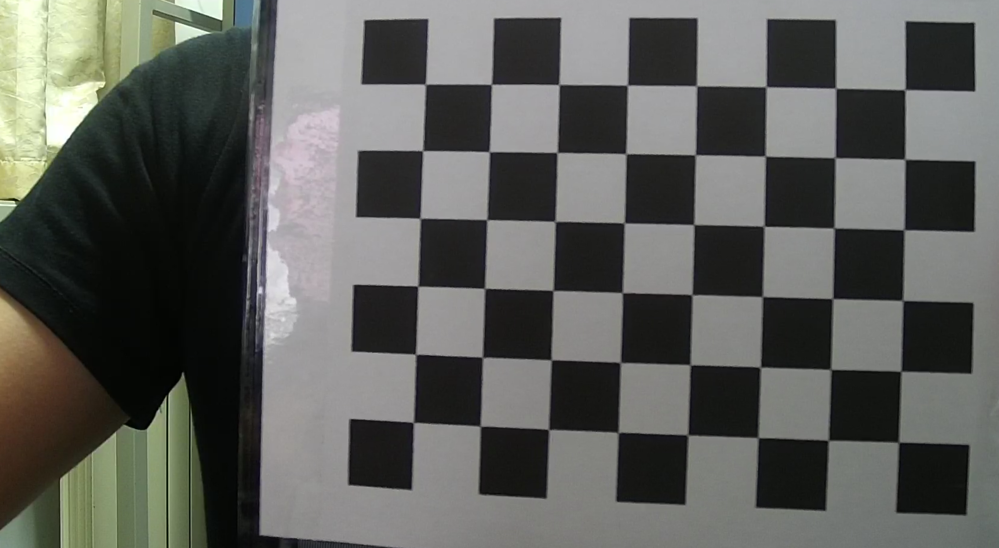

# 激光雷达和相机标定
## 一、依赖库
PCL + OpenCV

## 二、硬件
Livox Horizon 激光雷达 + Hikvision 相机

## 三、介绍
激光雷达和相机之间标定需要标定相机的内参、畸变系数，和相机相对于激光雷达的位姿。具体步骤如下所示：

1. 用张正友标定法标定相机内参和畸变系数，通过Matlab或者OpenCV等标定工具得到(cal_extrinsic.cpp中calib::zhang_zhengyou_calib函数)，实验中OpenCV的重投影精度比MatLab配准工具箱要小。
    
    

2. 点云不含纹理信息，因此不能用角点进行外参标定，这里用一块铁板在开阔的地区进行标定。

    

3. 使用livox-viewer录制点云流数据(.lvx文件)和用OpenCV抓图。

4. 使用lvx_parser文件夹下的pylvx.py脚本将lvx文件转成pcd文件。

5. 将多帧点云合成一帧(read_pcds_xyz函数)，然后分别进行点云特征点(interact_visualize函数)和图像对应特征点(Matlab)的提取，转换成一个
已知相机内参、三维点及对应投影点情况下计算相机位姿的PnP(Perspective-n-Point)问题。

    

6. 用OpenCV的SolvePnp函数(cal_calib函数)进行外参求解。

## 四、资源及参考资料

[1] [内参标定板](./resources/chess_board.png)

[2] [livox-官方标定方法](https://github.com/Livox-SDK/livox_camera_lidar_calibration)

[3] [Opencv SolvePNP API introduction](https://docs.opencv.org/2.4/modules/calib3d/doc/camera_calibration_and_3d_reconstruction.html#bool%20solvePnP)

[4] [OpenCV 张正友标定法](https://blog.csdn.net/dcrmg/article/details/52929669)
